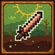
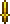

# 🗡️ ReDaggers

### P.S. Мод в разработке и скачать мод пока не получится. Поставьте звезду репозиторию чтобы следить за обновлениями.

### 🌍 [Русский](#русский) | [English](#english)

---

## 🇷🇺 Русский

### 📖 О моде
ReDaggers полностью перерабатывает систему кинжалов в Terraria, добавляет новые механики и аксессуары.

### ⚔️ Особенности

|  |  |  |  |  |
|:---:|:---:|:---:|:---:|:---:|
| **Система метания** | **Аксессуары** | **Новые Прожектайлы** | **Баланс** | **Новые механики и крафты** |

---

## 🇬🇧 English

### 📖 About
ReDaggers completely overhauls the dagger system in Terraria, adding new mechanics and accessories.

### ⚔️ Features

|  |  |  |  |  |
|:---:|:---:|:---:|:---:|:---:|
| **Throwing System** | **Accessories** | **New Projectiles** | **Balance** | **New Mechanics & Crafting** |

### ⚠️ P.S. The mod is in development and cannot be downloaded yet. Star the repository to follow updates.

---

    © 2025 Manukq. All rights reserved. 
    Made with ❤️ for the Terraria community

---

  Last updated: 24 апреля 2025 г.

